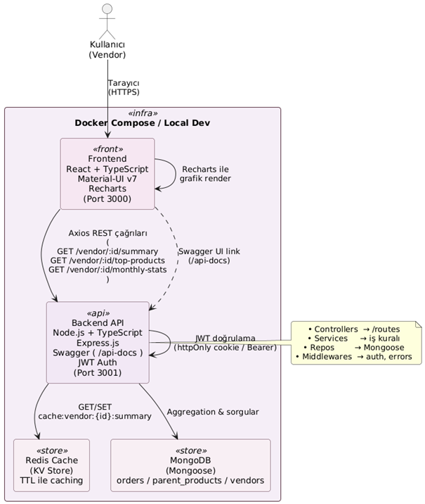
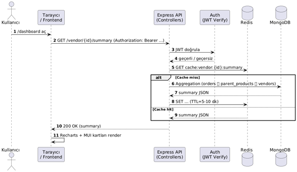
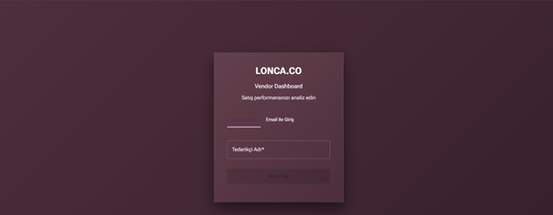
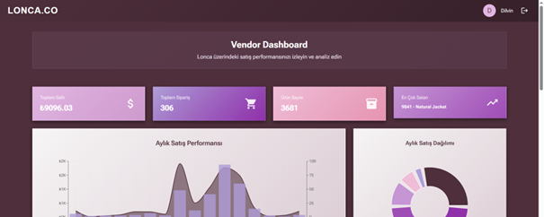
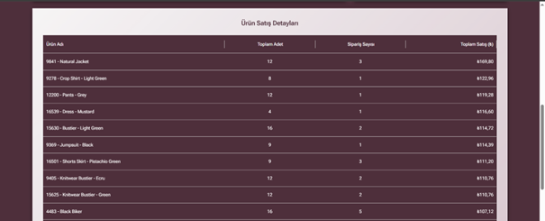
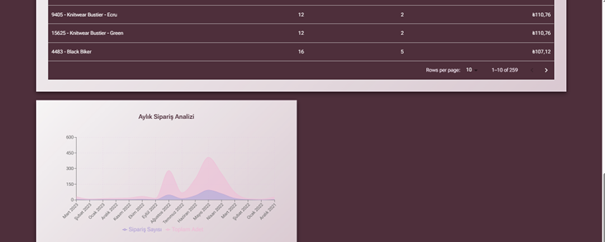

# Lonca Vendor Dashboard

A vendor analytics dashboard for e-commerce platforms built with React, Node.js, and MongoDB.

## Features

-  Real-time analytics dashboard
-  Monthly sales tracking
-  Product performance metrics
-  Revenue tracking
-  JWT authentication
-  Responsive design
-  Redis caching for performance
-  Swagger API documentation

## Tech Stack

### Backend
- Node.js + TypeScript
- Express.js
- MongoDB with Mongoose
- Redis for caching
- JWT authentication
- Swagger for API documentation

### Frontend
- React + TypeScript
- Material-UI v7
- Recharts for data visualization
- Axios for API calls

### System Architecture


### Use-Case Diagram


### Main screen and table/graph visuals:






Animations:


### Proje Koşulları

- Node.js (v18 or higher)
- MongoDB
- Redis
- Docker (optional)

### Installation

1. Clone the repository
```bash
git clone https://github.com/erdsel/supplier-dashboard.git
cd supplier-dashboard
```

2. Install backend dependencies
```bash
cd backend
npm install
```

3. Install frontend dependencies
```bash
cd ../frontend
npm install
```

### Environment Setup

Create `.env` file in the backend directory:

```env
NODE_ENV=development
PORT=3002
MONGODB_URI=mongodb://localhost:27017/lonca
JWT_SECRET=your-secret-key
JWT_EXPIRE=7d
CORS_ORIGIN=http://localhost:3000,http://127.0.0.1:3000
REDIS_HOST=localhost
REDIS_PORT=6380
API_URL=http://localhost:3002
```

### Running with Docker

#### Development Mode (with Hot-Reload)
```bash
# Windows
start-dev.bat

# Linux/Mac
./start-dev.sh

# Or using docker-compose directly
docker-compose -f docker-compose.dev.yml up
```

#### Production Mode
```bash
docker-compose up -d
```

#### Using Makefile (Recommended)
```bash
# Start development with hot-reload
make dev

# Stop development
make dev-down

# View logs
make dev-logs

# Restart development
make restart
```

### Running Locally

1. Start the backend server
```bash
cd backend
npm run dev
```

2. Start the frontend development server
```bash
cd frontend
npm start
```

3. Access the application at `http://localhost:3000`
4. API documentation available at `http://localhost:3002/api-docs`

## API Endpoints

### Authentication
- `POST /api/auth/login-by-name` - Login with vendor name

### Analytics
- `GET /api/analytics/monthly-sales/:vendorId` - Monthly sales data
- `GET /api/analytics/product-sales/:vendorId` - Product sales data
- `GET /api/analytics/vendor-stats/:vendorId` - Vendor statistics
- `GET /api/analytics/detailed/:vendorId` - Detailed analytics
- `GET /api/analytics/validate/:vendorId` - Data validation
- `GET /api/analytics/date-range/:vendorId` - Date range analytics
- `DELETE /api/analytics/cache/:vendorId` - Clear cache (Admin only)


